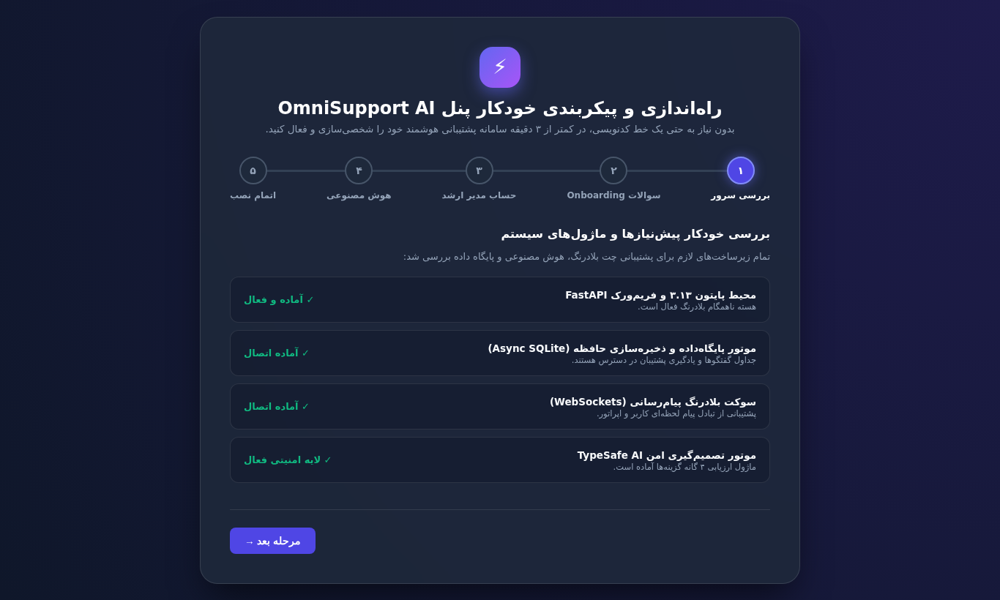
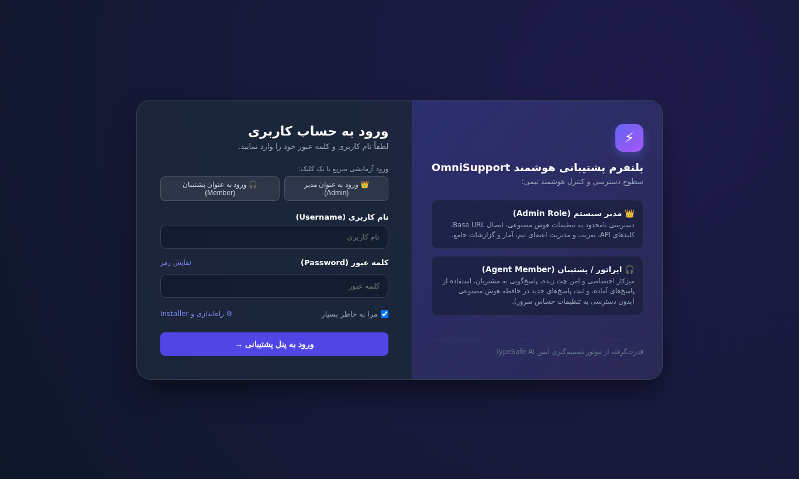
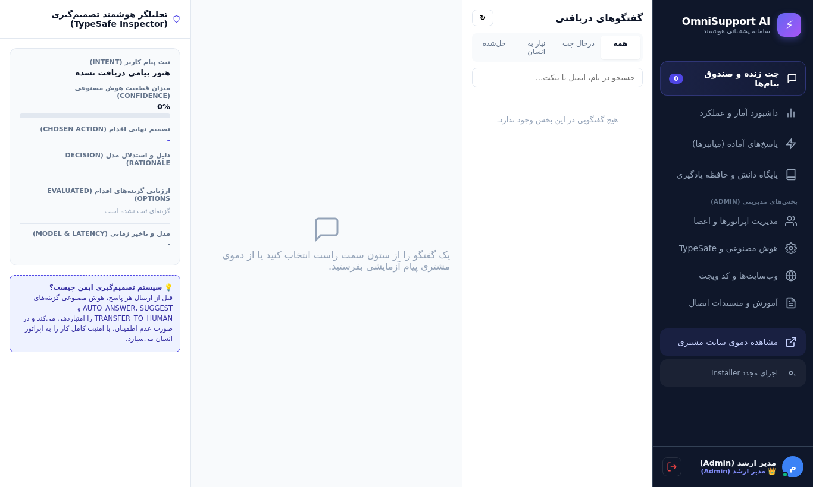
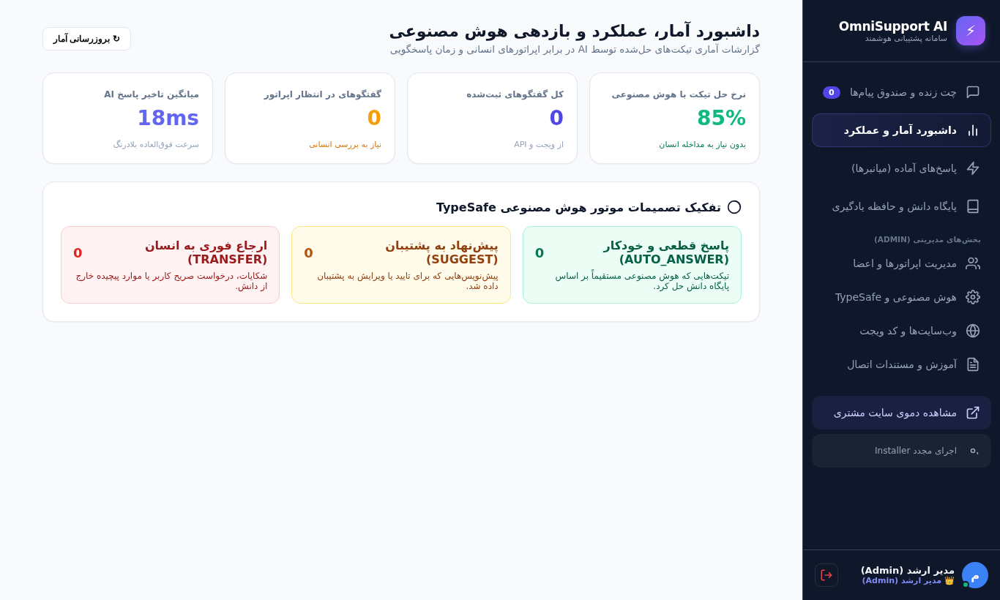
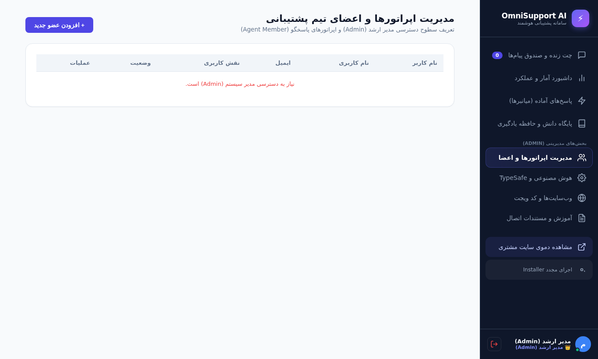
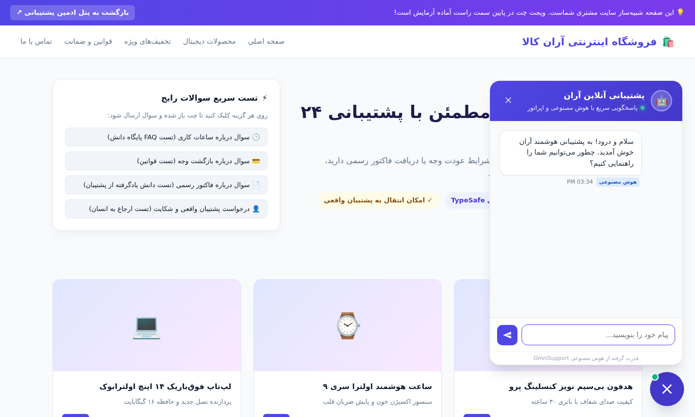

# ⚡ OmniSupport AI | سامانه جامع پشتیبانی هوشمند و چندکاناله با تصمیم‌گیری ایمن (TypeSafe AI)

<div align="center">


<p align="center">
  <b>یک پلتفرم سازمانی و استاندارد پشتیبانی مشتریان مجهز به اینستالر گرافیکی تحت وب (بدون نیاز به نوشتن کد)، تفکیک کامل نقش‌های مدیر (Admin) و اپراتور (Agent Member)، موتور تصمیم‌گیری ایمن TypeSafe AI و یادگیری پویا از پاسخ‌های پشتیبان‌ها.</b>
</p>

[نصب گرافیکی بدون کد](#-نصب-آسان-و-گرافیکی-تحت-وب-no-code-installer) • [پیش‌نمایش تصویری](#-پیش‌نمایش-تصویری-سیستم-screenshots) • [نقش‌های کاربری](#-سطوح-دسترسی-و-تفکیک-نقش‌ها-rbac) • [راه‌اندازی با داکر](#-راه‌اندازی-گام‌به‌گام-با-داکر-docker) • [اتصال ویجت](#-نحوه-اتصال-ویجت-به-وب‌سایت‌ها)

</div>

---

## 📸 پیش‌نمایش تصویری سیستم (Screenshots)

### ۱. ویزارد نصب گرافیکی و هوشمند (Web Setup Wizard & Onboarding)
کاربر برای نصب نیازی به هیچ دستوری ندارد؛ اینستالر تحت وب پیش‌نیازها را بررسی کرده، سوالات Onboarding را می‌پرسد و سیستم را در چند ثانیه راه‌اندازی می‌کند:



---

### ۲. صفحه ورود امن و تفکیک سطوح دسترسی (Modern Login & Roles)
ورود با پسورد هش‌شده امن (PBKDF2-SHA256)، توکن امضاشده و دکمه‌های ورود آزمایشی سریع:



---

### ۳. میزکار چت زنده و بازرس هوشمند تصمیم‌گیری (Live Chat & TypeSafe Inspector)
پاسخگویی به کاربران در لحظه از طریق وب‌سوکت، استفاده از پاسخ‌های آماده، و مشاهده زنده قطعیت، نیت و تحلیل گزینه‌های هوش مصنوعی:



---

### ۴. داشبورد آمار، عملکرد و بازدهی هوش مصنوعی (Analytics & KPI)
محاسبه درصد تیکت‌های حل‌شده توسط AI در برابر اپراتورهای انسانی، میانگین زمان پاسخگویی و نمودار تفکیک تصمیمات:



---

### ۵. مدیریت اپراتورها و اعضای تیم (Team & Member Roles)
امکان افزودن کارشناسان جدید، تعیین نقش (مدیر سیستم vs اپراتور پشتیبان) و مدیریت وضعیت آنلاین:



---

### ۶. دموی وب‌سایت مشتری و ویجت اختصاصی (Live Customer Widget Demo)
شبیه‌ساز فروشگاه مشتری با ویجت فعال و اتصال خودکار بلادرنگ:



---

## 🛠️ نصب آسان و گرافیکی تحت وب (No-Code Installer)

یکی از مهم‌ترین استانداردهای پنل‌های بین‌المللی این است که **مدیر یا کاربر نهایی نباید هیچ دستوری در ترمینال بزند!**

1. به آدرس `http://localhost:8000/install` بروید.
2. ویزارد ۵ مرحله‌ای را طی کنید:
   * **مرحله ۱:** بررسی سلامت خودکار سیستم (FastAPI، SQLite و WebSockets).
   * **مرحله ۲:** سوالات Onboarding (نام برند، حوزه فعالیت: فروشگاهی/SaaS/خدماتی، و لحن هوش مصنوعی: صمیمی/رسمی/تخصصی).
   * **مرحله ۳:** ساخت نام کاربری و رمز عبور مدیر ارشد.
   * **مرحله ۴:** انتخاب ارائه‌دهنده هوش مصنوعی (OpenAI, DeepSeek, Groq, Ollama) یا شروع با موتور محلی.
   * **مرحله ۵:** پایان نصب و ورود آنی به داشبورد ادمین!

---

## 👥 سطوح دسترسی و تفکیک نقش‌ها (RBAC)

سیستم به صورت استاندارد دارای دو نقش تفکیک‌شده است:

### 👑 ۱. مدیر ارشد سیستم (Super Admin)
* دسترسی کامل به تنظیمات حساس سرور، Base URL و کلیدهای API.
* مدیریت اعضای تیم، افزودن اپراتورهای جدید و تغییر نقش‌ها.
* مشاهده گزارشات تحلیلی، KPI، و شخصی‌سازی ظاهر و رنگ ویجت.

### 🎧 ۲. اپراتور / عضو پشتیبانی (Agent Member)
* میزکار اختصاصی چت بلادرنگ بدون شلوغی و پیچیدگی.
* پاسخگویی سریع به پیام‌های مشتریان با کلیدهای میانبر و پاسخ‌های آماده.
* دکمه **«🎓 آموزش به هوش مصنوعی»** جهت ثبت پاسخ‌های جدید در حافظه سیستم.
* **امنیت کامل:** تب‌های حساس تنظیمات سرور و کلیدهای API برای اپراتورها مخفی و قفل است.

---

## 🚀 راه‌اندازی سریع با داکر (Docker Compose)

```bash
# دریافت مخزن
git clone https://github.com/mohammad1390555/omni-support.git
cd omni-support

# اجرا با یک دستور
docker compose up -d --build
```

آدرس‌های در دسترس:
* **پنل مدیریت پشتیبانی:** `http://localhost:8000`
* **ورود به سیستم:** `http://localhost:8000/login`
* **نصب گرافیکی مجدد:** `http://localhost:8000/install`
* **دموی سایت مشتری:** `http://localhost:8000/widget-demo`

> **نام کاربری و رمز عبور پیش‌فرض تست:**  
> * مدیر (Admin): `admin` / `admin123`  
> * پشتیبان (Agent): `agent1` / `agent123`

---

## 🧩 نحوه اتصال ویجت به وب‌سایت‌ها

کد زیر را قبل از بسته شدن تگ `</body>` در قالب هر سایتی بگذارید:

```html
<!-- OmniSupport AI Live Chat Widget -->
<script 
  src="http://YOUR-DOMAIN:8000/static/widget.js" 
  data-site-id="site_default" 
  data-api-url="http://YOUR-DOMAIN:8000" 
  async>
</script>
```

---

## ⚡ مستندات کامل REST API

ارسال مستقیم تیکت از بک‌اند وب‌سایت‌ها:

```bash
curl -X POST "http://YOUR-DOMAIN:8000/api/v1/external/tickets" \
  -H "Content-Type: application/json" \
  -H "X-Site-Key: omni_live_k8s92f8a129d38c71e041" \
  -d '{
    "site_id": "site_default",
    "customer_id": "user_491",
    "customer_name": "سارا کریمی",
    "message": "سلام، فاکتور خرید من صادر نشده است."
  }'
```

---

## 👨‍💻 توسعه‌دهنده
ساخته‌شده با ❤️ توسط [mohammad1390555](https://github.com/mohammad1390555)
