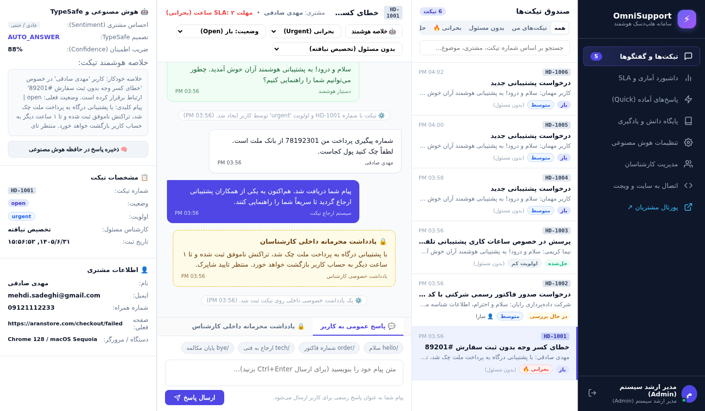
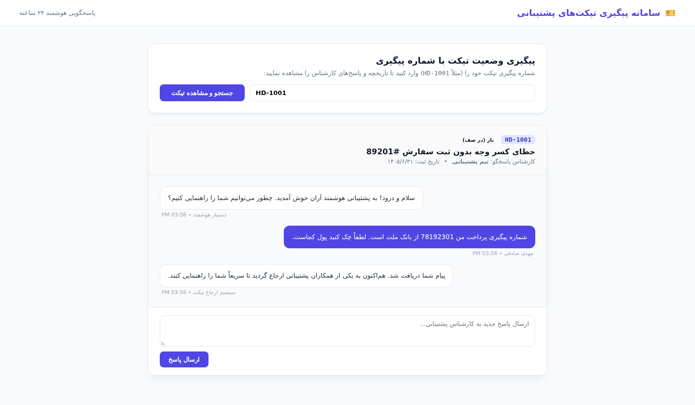
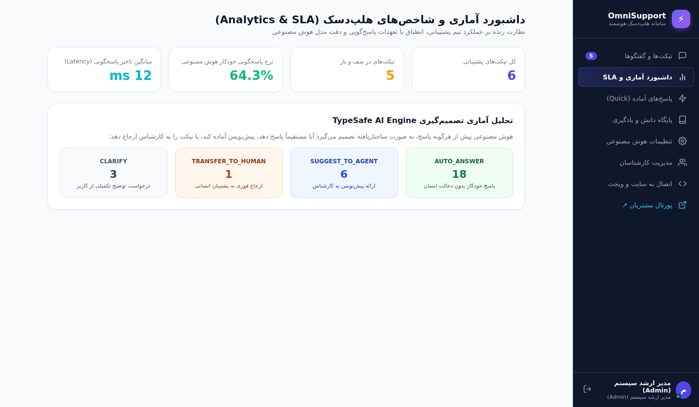
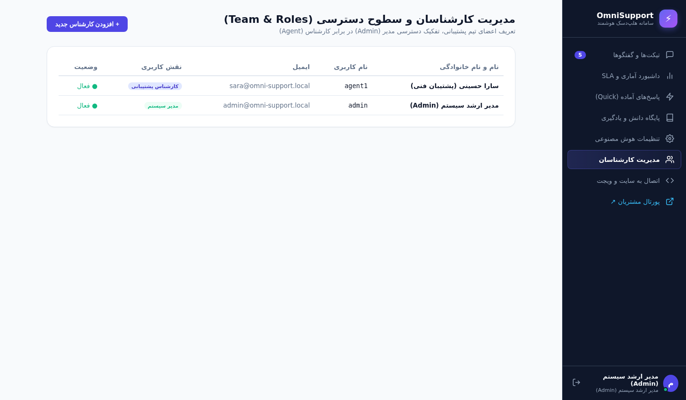
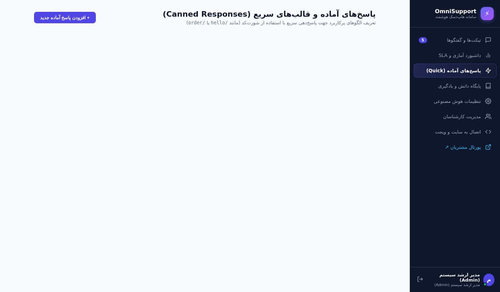

# ⚡ OmniSupport Enterprise Helpdesk & TypeSafe AI Platform
> **پلتفرم هلپ‌دسک و سامانه مدیریت تیکتینگ هوشمند سازمانی الهام‌گرفته از Frappe Helpdesk و Linear**  
> مجهز به موتور تصمیم‌گیری ساختاریافته **TypeSafe AI Decision Engine**، یادگیری مداوم از کارشناسان، پورتال پیگیری مشتریان، ویجت گفتگوی زنده، ویزارد نصب بدون کد و پشتیبانی کامل از داکر (Docker).

---

## 📸 گالری تصاویر و نمای بخش‌های مختلف سامانه (Screenshots)

### ۱. میزکار هلپ‌دسک سازمانی (Frappe & Linear 3-Pane Workspace)
نمای ۳ ستونه پیشرفته شامل صندوق فیلتر تیکت‌ها (همه، تیکت‌های من، بدون مسئول، بحرانی، حل‌شده)، تاریخچه گفتگو با تفکیک **پاسخ عمومی (Public Reply)** و **یادداشت محرمانه کارشناسان (Private Internal Note)**، نوار پاسخ‌های آماده، تحلیل احساس مشتری و موتور TypeSafe AI:


---

### ۲. پورتال اختصاصی پیگیری تیکت‌های مشتریان (Customer Tracking Portal)
صفحه عمومی پیگیری تیکت برای مشتریان با شناسه رهگیری (مانند `HD-1001`)، مشاهده وضعیت زنده، نام کارشناس پاسخگو و امکان ارسال مستقیم پاسخ (با پنهان‌سازی خودکار و امن یادداشت‌های داخلی):


---

### ۳. داشبورد نظارتی آمار، عملکرد و تعهدات پاسخ‌گویی (Analytics & SLA)
شاخص‌های کلیدی عملکرد (KPIs)، نرخ پاسخگویی خودکار هوش مصنوعی، رعایت مهلت SLA، میانگین زمان تاخیر (Latency) و نمودار تصمیمات چهارگانه موتور TypeSafe AI:


---

### ۴. ویزارد گرافیکی و راه‌اندازی اولیه بدون ترمینال (Web Installer Wizard)
راه‌اندازی صفر تا صد سامانه بدون نیاز به دستورات متنی؛ تنها در ۵ گام تعاملی با تست اتصال هوش مصنوعی و تزریق پرامپت‌های تخصصی:


---

### ۵. صفحه امن ورود و تفکیک نقش‌های کاربری (Role-Based Authentication)
ورود امن با هش‌گذاری استاندارد PBKDF2 و تفکیک دسترسی مدیر ارشد (Admin) و اعضای تیم پشتیبانی (Agent Member):


---

### ۶. مدیریت اعضای تیم و سطوح دسترسی (Team & Roles Management)
تعریف و مدیریت اعضای تیم پشتیبانی، تغییر سطوح دسترسی و وضعیت فعال/غیرفعال بودن کارشناسان:


---

### ۷. الگوها و میانبرهای پاسخ سریع (Canned Responses)
تعریف و مدیریت قالب‌های متنی پرکاربرد با شورت‌کدهای اختصاصی (مانند `/hello`، `/order`، `/tech`، `/bye`):


---

### ۸. ویجت گفتگوی زنده متصل به سایت (Live Customer Widget)
ویجت بسیار سبک، سریع و مدرن قابل تعبیه در هر وب‌سایت با پشتیبانی از وب‌سوکت دوطرفه و نمایش کد پیگیری تیکت به مشتری:


---

## 🌟 قابلیت‌های برجسته سامانه (Key Features)

### 1. معماری هلپ‌دسک در کلاس سازمانی (Enterprise Helpdesk Architecture)
- **کدگذاری متوالی تیکت‌ها:** شماره‌گذاری دقیق و استاندارد تیکت‌ها مانند `HD-1001`، `HD-1002` و...
- **سطوح اولویت چهارگانه:** بحرانی (`Urgent 🔥`)، بالا (`High`)، متوسط (`Medium`)، کم (`Low`).
- **وضعیت‌های استاندارد چرخه حیات تیکت:** باز (`Open`)، در حال بررسی (`In Progress`)، در انتظار پاسخ مشتری (`Pending Customer`)، حل‌شده (`Resolved`) و بسته (`Closed`).
- **ارجاع هوشمند به کارشناسان:** امکان واگذاری تیکت به کارشناس خاص یا قرارگیری در صف عمومی.
- **تعهدات پاسخ‌گویی (SLA Tracking):** محاسبه و هشدار مهلت زمانی پاسخ بر اساس اولویت تیکت (مثلاً ۲ ساعت برای تیکت‌های بحرانی).
- **یادداشت‌های محرمانه داخلی (Internal Notes):** ثبت تحلیل‌ها و گزارشات درون‌تیمی با برچسب زرد و علامت قفل که هرگز برای کاربر در وب‌سایت یا پورتال نمایش داده نمی‌شود.
- **لاگ تاریخچه و فعالیت‌ها (Activity Timeline Audit):** ثبت تمامی رویدادها شامل تغییر وضعیت، تغییر اولویت، ارجاع تیکت و یادگیری مدل.

### 2. پورتال عمومی پیگیری تیکت مشتریان (Customer Tracking Portal)
- مسیر اختصاصی `/portal` و `/portal?ticket=HD-1001` برای مشتریان بدون نیاز به احراز هویت پیچیده.
- مشاهده پیشرفت تیکت، پیام‌های کارشناس و سیستم.
- امکان ارسال پاسخ متقابل مستقیم از مرورگر کاربر.

### 3. موتور هوشمند TypeSafe AI Decision Engine
پیش از هرگونه پاسخ‌گویی به مشتری، هوش مصنوعی پرسش را تحلیل کرده و ابتدا از میان ۴ گزینه ساختاریافته تصمیم‌گیری می‌کند:
1. **`AUTO_ANSWER`**: ضریب اطمینان بالا بر اساس پایگاه دانش (RAG) $\rightarrow$ پاسخگویی خودکار آنی.
2. **`SUGGEST_TO_AGENT`**: پاسخ احتمالی تهیه و به عنوان Co-pilot تنها به کارشناس پیشنهاد می‌شود.
3. **`TRANSFER_TO_HUMAN`**: در موارد پیچیده، نارضایتی، خشم مشتری یا درخواست مستقیم انتقال به انسان $\rightarrow$ اولویت به `Urgent` تغییر کرده و تیکت به صف انسانی منتقل می‌شود.
4. **`CLARIFY`**: اطلاعات کاربر مبهم یا ناقص است $\rightarrow$ درخواست توضیحات تکمیلی.

### 4. یادگیری مداوم از کارشناسان (Agent Learning Loop)
هر زمان که یک کارشناس انسانی به سوالی پاسخ دهد، با یک کلیک روی **"ذخیره در حافظه هوش مصنوعی"**، جفت پرسش و پاسخ تحلیل شده، کلیدواژه‌ها استخراج شده و به عنوان یک دانش تایید شده در دیتابیس ذخیره می‌شود تا در دفعات بعدی هوش مصنوعی بتواند سوالات مشابه را خودکار پاسخ دهد.

### 5. سازگاری با هر ارائه‌دهنده LLM با لینک و کلید دلخواه
- قابلیت تنظیم دلخواه **Base URL (Base Link)**، **API Key**، و **Model Name**.
- پریست‌های آماده برای **OpenAI**، **OpenRouter**، **Groq** و مدل‌های محلی **Ollama** (`http://localhost:11434/v1`).
- امکان شخصی‌سازی کامل پرامپت سیستمی و آستانه ضریب اطمینان (Threshold).

---

## 🚀 راهنمای سریع راه‌اندازی (Quick Start)

### روش اول: راه‌اندازی سریع با داکر (Docker & Docker Compose)
```bash
# ۱. دریافت پروژه
git clone https://github.com/mohammad1390555/omni-support.git
cd omni-support

# ۲. اجرای کانتینر با داکر کامپوز
docker-compose up -d --build
```
سپس مرورگر خود را باز کرده و به آدرس زیر بروید:
- **ویزارد راه‌اندازی گرافیکی:** `http://localhost:8000/install`
- **ورود به پنل:** `http://localhost:8000/login`
- **پورتال مشتریان:** `http://localhost:8000/portal`

---

### روش دوم: راه‌اندازی با پایتون (Python Native)
```bash
# پیش‌نیاز: پایتون 3.10 به بالا
cd omni-support/backend

# ساخت و فعال‌سازی محیط مجازی
python3 -m venv venv
source venv/bin/activate  # در ویندوز: venv\Scripts\activate

# نصب وابستگی‌ها
pip install -r requirements.txt

# اجرای سرور
python3 -m uvicorn app.main:app --host 0.0.0.0 --port 8000 --reload
```

---

## 🔑 اطلاعات ورود پیش‌فرض (Default Credentials)

| نقش کاربری | نام کاربری | رمز عبور | سطح دسترسی |
|:---|:---|:---|:---|
| **مدیر ارشد (Admin)** | `admin` | `admin123` | دسترسی کامل به تمامی بخش‌ها، تنظیمات هوش مصنوعی، مدیریت کارشناسان و آمار |
| **کارشناس فنی (Agent)** | `agent1` | `agent123` | دسترسی به میزکار تیکت‌ها، پاسخ‌گویی، ثبت یادداشت محرمانه و یادگیری هوش مصنوعی |

---

## 🔌 نحوه اتصال ویجت به وب‌سایت‌ها (Integration Guide)

کافی است تگ زیر را قبل از بسته شدن تگ `</body>` در قالب وب‌سایت یا سیستم مدیریت محتوای خود (مانند وردپرس) قرار دهید:

```html
<!-- OmniSupport Live Chat & Ticketing Widget -->
<script 
  src="http://YOUR-SERVER-IP:8000/static/widget.js" 
  data-site-id="site_default" 
  data-api-base="http://YOUR-SERVER-IP:8000" 
  defer>
</script>
```

---

## 📄 لایسنس
توسعه یافته تحت مجوز MIT License. استفاده تجاری و سازمانی کاملاً آزاد است.
