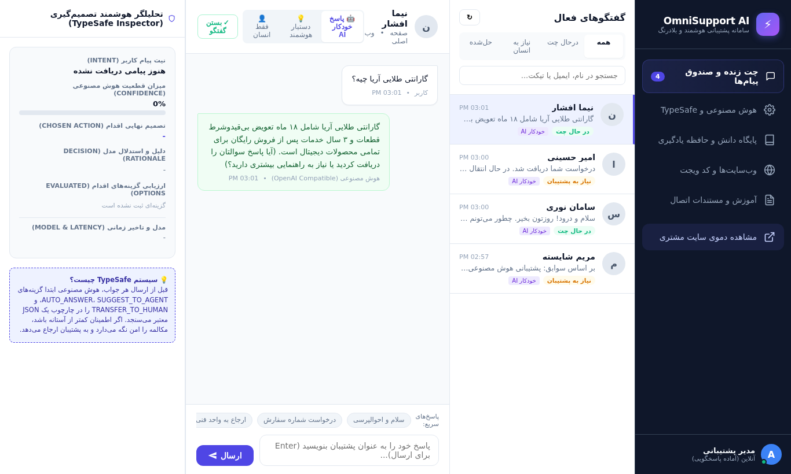
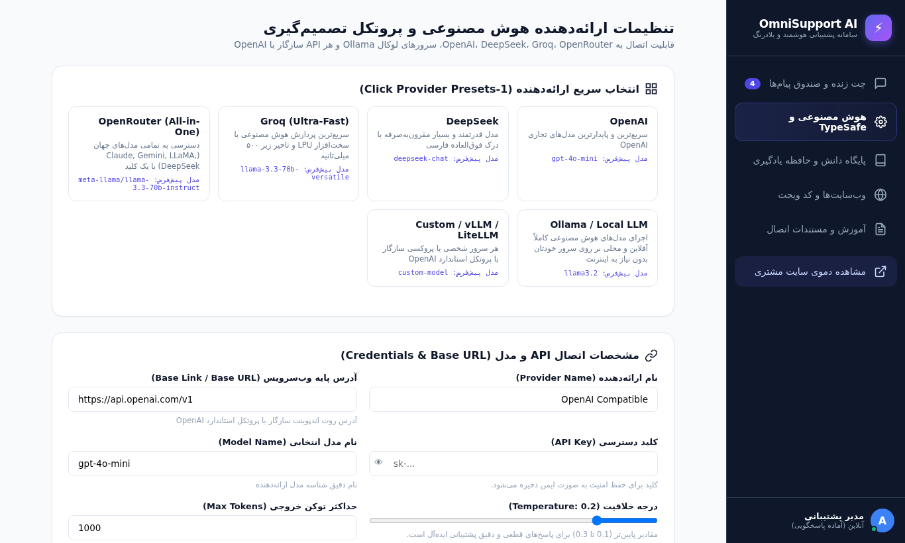
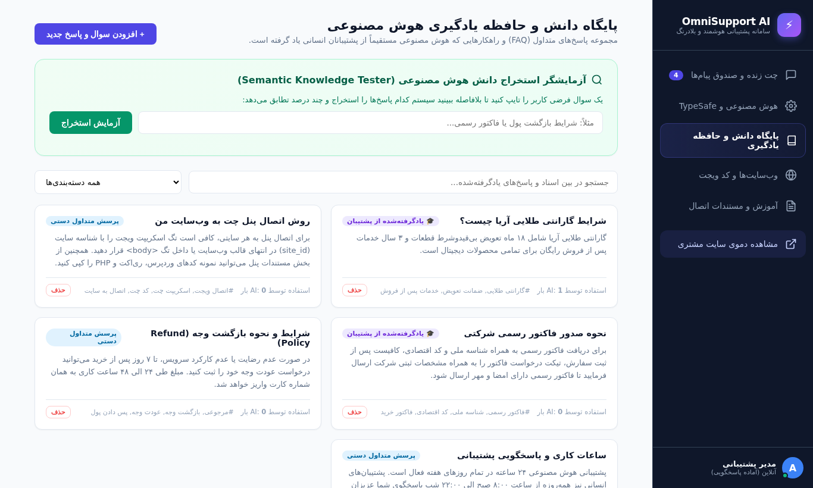
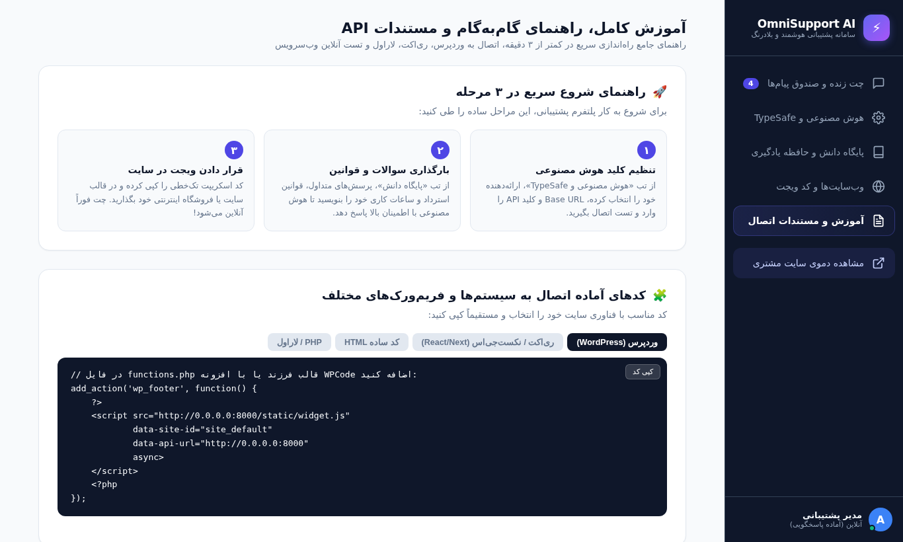
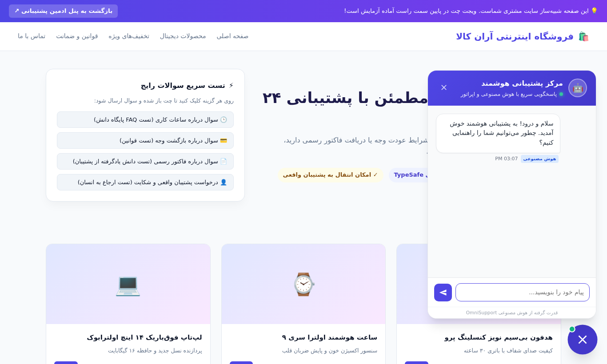

# ⚡ OmniSupport AI | سامانه پشتیبانی هوشمند و چندکاناله با تصمیم‌گیری ایمن (TypeSafe AI)

<div align="center">


<p align="center">
  <b>یک پلتفرم پشتیبانی تراز اول، مدرن و تعبیه‌پذیر که هم امکان پاسخ‌دهی خودکار توسط هوش مصنوعی (AI) و هم پاسخ‌گویی اپراتورهای انسانی را فراهم می‌کند. مجهز به موتور تصمیم‌گیری ایمن TypeSafe AI و مکانیزم یادگیری پویا از پشتیبان‌ها.</b>
</p>

[ویژگی‌ها](#-ویژگی‌های-کلیدی) • [پیش‌نمایش تصویری](#-پیش‌نمایش-تصویری-سیستم) • [راه‌اندازی با داکر](#-راه‌اندازی-گام‌به‌گام-با-داکر-docker) • [اتصال به وب‌سایت](#-نحوه-اتصال-ویجت-به-وب‌سایت‌ها) • [مستندات REST API](#-مستندات-کامل-rest-api)

</div>

---

## 📸 پیش‌نمایش تصویری سیستم (Screenshots)

### ۱. میزکار چت زنده و بازرس هوشمند تصمیم‌گیری (Live Chat & TypeSafe Inspector)
در این بخش، پشتیبان پیام‌های کاربران را در لحظه دریافت کرده، می‌تواند حالت پاسخگویی (خودکار AI، دستیار، یا فقط انسان) را تغییر دهد و در سایدبار سمت چپ، تحلیل بلادرنگ نیت، قطعیت و گزینه‌های تصمیم‌گیری مدل را ببیند:



---

### ۲. تنظیمات هوش مصنوعی، Base URL و مدل‌ها (AI Providers & Credentials)
امکان انتخاب سریع با ۱ کلیک از بین OpenAI, DeepSeek, Groq, OpenRouter, Ollama و اتصال به هر Base Link دلخواه به همراه تست زنده پینگ و جدول لاگ‌های تصمیم:



---

### ۳. پایگاه دانش و حافظه یادگیری هوش مصنوعی (Knowledge Base & Memory)
جایی که پاسخ‌های تاییدشده پشتیبانان انسانی ذخیره می‌شود تا هوش مصنوعی در دفعات بعد با قطعیت بالا از آن‌ها استفاده کند، به همراه شبیه‌ساز تست استخراج معنایی:



---

### ۴. آموزش و مستندات تعاملی درون پنل (Interactive Docs & API Tester)
آموزش کامل گام‌به‌گام، کدهای آماده وردپرس، ری‌اکت و PHP به همراه تستر آنلاین REST API برای ثبت مستقیم تیکت آزمایشی:



---

### ۵. دموی وب‌سایت مشتری و ویجت اختصاصی (Live Customer Widget Demo)
شبیه‌ساز فروشگاه آنلاین مشتری با ویجت تعبیه‌شده در گوشه صفحه که با سرعت بالا و انیمیشن روان به کاربران پاسخ می‌دهد:



---

## 🌟 ویژگی‌های کلیدی

### ۱. موتور تصمیم‌گیری ایمن (TypeSafe AI Decision Engine)
* پیش از پاسخ به مشتری، هوش مصنوعی ابتدا در قالب یک JSON Schema تایپ‌شده، چهار سناریو را ارزیابی و امتیازدهی می‌کند:
  * `AUTO_ANSWER`: پاسخ خودکار فقط وقتی قطعیت بالاتر از آستانه مجاز (مثلاً بالای ۷۵٪) باشد و سند معتبری وجود داشته باشد.
  * `SUGGEST_TO_AGENT`: آماده‌سازی پیش‌نویس برای پشتیبان انسانی (حالت Co-pilot) با امکان تایید یا ویرایش با یک کلیک.
  * `TRANSFER_TO_HUMAN`: ارجاع مکالمه به پشتیبان انسانی در صورت ابراز نارضایتی، شکایت کاربر، یا عدم تطابق با پایگاه دانش.
  * `CLARIFY`: درخواست سوال شفاف‌کننده در صورت ابهام سوال کاربر.

### ۲. یادگیری هوش مصنوعی از پشتیبان‌های واقعی (Agent-to-AI Learning)
* زمانی که اپراتور انسانی پاسخ سوالی را تایپ می‌کند، با کلیک روی گزینه **«🎓 آموزش به هوش مصنوعی»**، این راهکار تاییدشده در پایگاه دانش ذخیره می‌شود.
* در سوالات بعدی سایر کاربران، سیستم با موتور تطابق معنایی و کلیدواژه‌ای این دانش را استخراج کرده و هوش مصنوعی خودش مستقیماً به آن پاسخ می‌دهد.

### ۳. پشتیبانی از تمامی مدل‌ها و ارائه‌دهنده‌ها (OpenAI Compatible)
* فیلدهای کاملاً منعطف برای **Base URL**، **API Key**، نام مدل و ارائه‌دهنده.
* امکان اتصال به OpenAI (`gpt-4o`, `gpt-4o-mini`)، DeepSeek (`deepseek-chat`)، Groq (`llama-3.3-70b-versatile`)، OpenRouter و سرورهای محلی آفلاین Ollama.
* مجهز به دکمه تست زنده اتصال (Ping Test) با نمایش تاخیر میلی‌ثانیه‌ای (Latency ms).

### ۴. ویجت تعبیه‌پذیر در هر وب‌سایت (Embeddable Widget)
* یک فایل اسکریپت سبک (`widget.js`) بدون وابستگی خارجی (Zero Dependencies).
* نصب فوق‌سریع در وردپرس، ری‌اکت، نکست‌جی‌اس، لاراول و HTML معمولی با یک خط کد.
* سفارشی‌سازی رنگ تم سازمانی، عنوان، متن پیام خوش‌آمدگویی و موقعیت راست/چپ از داخل پنل.

---

## 🚀 راه‌اندازی گام‌به‌گام با داکر (Docker)

ساده‌ترین و پایدارترین روش راه‌اندازی استفاده از Docker و Docker Compose است:

### گام ۱: کلون کردن مخزن
```bash
git clone https://github.com/mohammad1390555/omni-support.git
cd omni-support
```

### گام ۲: تنظیم متغیرهای محیطی (اختیاری)
فایل نمونه `.env.example` را کپی کنید:
```bash
cp .env.example .env
```

### گام ۳: اجرای کانتینرها
```bash
docker compose up -d --build
```

سرویس بلافاصله روی پورت **8000** بالا می‌آید:
* **پنل مدیریت و چت پشتیبان:** `http://localhost:8000`
* **دموی سایت مشتری با ویجت فعال:** `http://localhost:8000/widget-demo`
* **مستندات Swagger API:** `http://localhost:8000/docs`

برای مشاهده لاگ‌های داکر:
```bash
docker compose logs -f
```

برای خاموش کردن سرویس:
```bash
docker compose down
```

---

## 💻 راه‌اندازی محلی با پایتون (بدون داکر)

اگر می‌خواهید مستقیماً با پایتون روی سرور لینوکس یا سیستم شخصی اجرا کنید:

```bash
# ۱. رفتن به پوشه بک‌اند
cd omni-support/backend

# ۲. ایجاد و فعال‌سازی محیط مجازی
python3 -m venv venv
source venv/bin/activate  # در ویندوز: venv\Scripts\activate

# ۳. نصب وابستگی‌ها
pip install -r requirements.txt

# ۴. اجرای سرور
python3 -m uvicorn app.main:app --host 0.0.0.0 --port 8000 --reload
```

---

## 🧩 نحوه اتصال ویجت به وب‌سایت‌ها

کد زیر را کپی کرده و قبل از بسته شدن تگ `</body>` در صفحات سایت خود بگذارید:

```html
<!-- OmniSupport AI Live Chat Widget -->
<script 
  src="http://YOUR-DOMAIN:8000/static/widget.js" 
  data-site-id="site_default" 
  data-api-url="http://YOUR-DOMAIN:8000" 
  async>
</script>
```

### نمونه اتصال در وردپرس (WordPress)
در فایل `functions.php` قالب فرزند یا با افزونه **WPCode**:
```php
add_action('wp_footer', function() {
    ?>
    <script 
      src="http://YOUR-DOMAIN:8000/static/widget.js" 
      data-site-id="site_default" 
      data-api-url="http://YOUR-DOMAIN:8000" 
      async>
    </script>
    <?php
});
```

### نمونه اتصال در ری‌اکت و نکست‌جی‌اس (React / Next.js)
```jsx
import { useEffect } from 'react';

export default function SupportWidget() {
  useEffect(() => {
    const script = document.createElement('script');
    script.src = 'http://YOUR-DOMAIN:8000/static/widget.js';
    script.setAttribute('data-site-id', 'site_default');
    script.setAttribute('data-api-url', 'http://YOUR-DOMAIN:8000');
    script.async = true;
    document.body.appendChild(script);

    return () => {
      document.body.removeChild(script);
    };
  }, []);

  return null;
}
```

---

## ⚡ مستندات کامل REST API

شما می‌توانید با هر زبان برنامه‌نویسی مستقیماً از بک‌اند خود تیکت و پیام ارسال کنید:

### ۱. ایجاد تیکت یا ارسال پیام از سایت مشتری
* **آدرس:** `POST /api/v1/external/tickets`
* **هدر:** `X-Site-Key: omni_live_k8s92f8a129d38c71e041`

#### نمونه درخواست cURL:
```bash
curl -X POST "http://YOUR-DOMAIN:8000/api/v1/external/tickets" \
  -H "Content-Type: application/json" \
  -H "X-Site-Key: omni_live_k8s92f8a129d38c71e041" \
  -d '{
    "site_id": "site_default",
    "customer_id": "user_102",
    "customer_name": "رضا عباسی",
    "customer_email": "reza@example.com",
    "message": "سلام، شرایط بازگشت وجه چطور است؟",
    "current_page": "/checkout"
  }'
```

#### نمونه کد در پایتون (Python Requests):
```python
import requests

url = "http://YOUR-DOMAIN:8000/api/v1/external/tickets"
headers = {
    "Content-Type": "application/json",
    "X-Site-Key": "omni_live_k8s92f8a129d38c71e041"
}
payload = {
    "site_id": "site_default",
    "customer_id": "user_102",
    "customer_name": "رضا عباسی",
    "message": "سلام، شرایط بازگشت وجه چطور است؟"
}

response = requests.post(url, json=payload, headers=headers)
print("پاسخ سرور:", response.json())
```

---

## 📁 ساختار فایل‌های پروژه

```text
omni-support/
├── backend/
│   ├── app/
│   │   ├── config.py              # تنظیمات محیطی و پایگاه‌داده
│   │   ├── database.py            # پیکربندی Async SQLAlchemy
│   │   ├── models.py              # مدل‌های دیتابیس (Conversations, Messages, Decisions, Knowledge)
│   │   ├── schemas.py             # شِمای اعتبارسنجی تایپ‌شده Pydantic
│   │   ├── main.py                # هسته FastAPI و مدیریت استاتیک
│   │   ├── routers/               # روت‌های API (AI, Chat, Knowledge, Sites, External)
│   │   ├── services/
│   │   │   ├── ai_service.py      # کلاینت همگانی سازگار با OpenAI و سنجش تاخیر
│   │   │   ├── typesafe_ai.py     # موتور تصمیم‌گیری ایمن TypeSafe AI
│   │   │   ├── learning_service.py# موتور یادگیری و استخراج معنایی پاسخ‌های پشتیبان
│   │   │   └── websocket_manager.py# ارتباطات دوطرفه بلادرنگ
│   │   └── static/
│   │       ├── widget.js          # اسکریپت تعبیه‌پذیر کلاینت
│   │       └── widget.css         # استایل‌های مستقل ویجت
│   ├── Dockerfile                 # ایمیج بهینه‌شده پایتون 3.13
│   └── requirements.txt
├── frontend/                      # پنل مدیریت و میزکار پشتیبان (SPA)
│   ├── index.html
│   ├── customer_demo.html         # شبیه‌ساز فروشگاه مشتری
│   ├── css/style.css
│   └── js/ (app.js, chat.js, ai-settings.js, knowledge.js, docs.js)
├── docs/screenshots/              # اسکرین‌شات‌های پنل
├── docker-compose.yml             # راه‌اندازی سریع کل پشته
├── .env.example                   # متغیرهای محیطی نمونه
├── README.md                      # مستندات کامل فارسی و انگلیسی
└── redem.md                       # کپی مستندات
```

---

## 🛡️ امنیت و حریم خصوصی
* کلیدهای API ارائه‌دهندگان به صورت محافظت‌شده نگهداری می‌شوند و در پاسخ‌های عمومی نمایش داده نمی‌شوند.
* ویجت دارای سیستم شناسه منحصر‌به‌فرد سشن برای حفظ گفتگوها در زمان رفرش صفحه است.
* تفکیک کامل پیام‌های داخلی (پیش‌نویس‌های AI) از پیام‌های عمومی ارسالی به مشتری.

---

## 👨‍💻 توسعه‌دهنده
ساخته‌شده با ❤️ توسط [mohammad1390555](https://github.com/mohammad1390555)
